# Graph Explorer

A full-stack, AI-powered Graph Visualization and Data Exploration platform.
This framework takes natural language questions ("Show me sales orders related to delivery X"),
deduces the required database multi-hop join paths using Google Gemini, runs the SQL natively, and
builds a real-time reactive Graph showing how the extracted rows relate to each other.

## Architecture Structure

The mono-repository is structured cleanly separating concerns:

### /frontend
A React.js application rendering real-time graphs with D3-force optimization via React Flow.
- **`src/components/`**: Pure UI layout components, separated from logic.
- **`src/hooks/`**: Business logic extraction (e.g., `useChatEngine.js` for API syncing).
- **`src/store/`**: Global Zustand state for history caching and view modes.

### /backend
An Express Node.js application driving the AI interpretation pipeline.
- **`src/controllers/`**: HTTP Request mapping directly controlling the business flow.
- **`src/services/`**: Independent, testable layers (Multi-Hop deduction, Neo4j Graph Builder, Postgres Execution Queue).
- **`src/config/`**: Centralized Database credentials and Schema mappings.
- **`src/scripts/`**: Development utility scripts for pinging and validating DB/AI models.

## Usage

**Frontend**
```bash
cd frontend
npm run dev
```

**Backend**
```bash
cd backend
node index.js
```


Copy

# Dodge-AI Graph Explorer
 
> A natural language-powered graph exploration tool for navigating complex datasets through conversation, visual graphs, and structured tables.
 
---
 
## Table of Contents
 
- [Overview](#overview)
- [Interface Layout](#interface-layout)
- [Executing a Query](#executing-a-query)
- [Graph Visualization](#graph-visualization)
- [Exploring Node Relationships](#exploring-node-relationships)
- [Filtering and Data Selection](#filtering-and-data-selection)
- [Performance and Rendering](#performance-and-rendering)
- [Query History](#query-history)
- [Natural Language Capability](#natural-language-capability)
- [Guardrails and Query Scope](#guardrails-and-query-scope)
- [Asset Structure](#asset-structure)
 
---
 
## Overview
 
The Dodge-AI Graph Explorer combines **natural language querying**, **visual graph exploration**, and **structured table inspection** to make navigating complex datasets intuitive and efficient. Instead of writing manual queries, you simply describe what you want to find — the system handles the rest.
 
---
 
## Interface Layout
 
When the application loads, the screen is divided into two primary areas:
 
### Chat Panel *(Right Side)*
 
This is where you interact with the AI.
 
- Type queries in plain English
- The system interprets your intent and retrieves relevant data
 
**Example query:**
```
Trace the full flow of a billing document
```
 
<p align="center">
  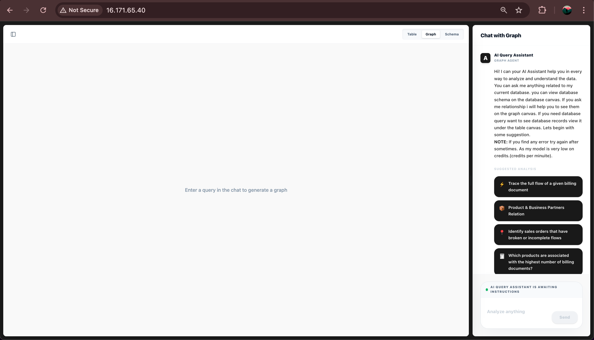
</p>
 
---
 
### Main Canvas *(Center Workspace)*
 
The central workspace contains three functional views:
 
| View | Purpose |
|---|---|
| **Database Schema Viewer** | Understand how entities are structured and related before querying |
| **Graph View** | Visual representation of nodes and edges when relationships are involved |
| **Table View** | Structured results with filtering and row selection |
 
<p align="center">
  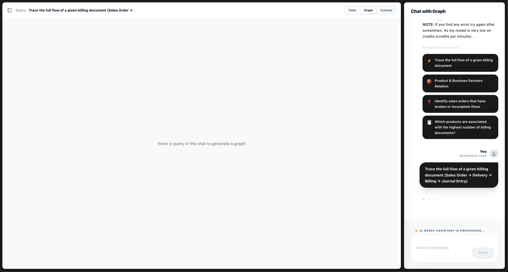
</p>

<p align="center">
  
</p>

---
 
## Executing a Query
 
1. Type your query in the chat panel and submit it.
2. The system sends the request to the backend.
3. A **processing indicator** appears while the query runs.
4. The query is **logged in the sidebar** for later reuse.
 
<p align="center">
  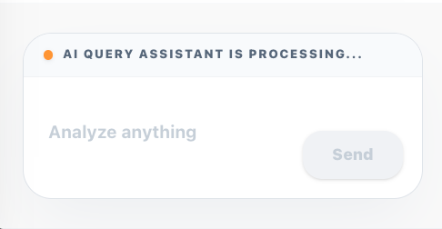
</p>
 
Once complete, the system returns:
 
- A **graph** (if relationships are involved)
- A **structured explanation** of the result
 
<p align="center">
  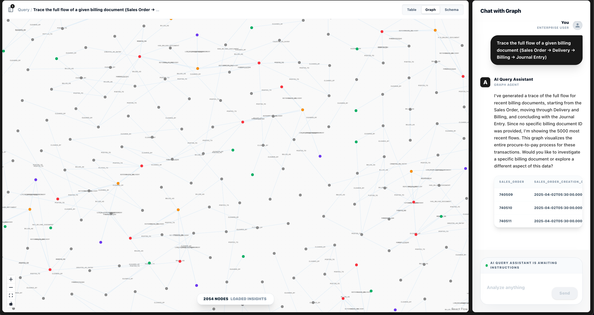
</p>
 
---
 
## Graph Visualization
 
When a query involves relationships between entities:
 
- **Nodes** represent entities (e.g., orders, deliveries, documents)
- **Edges** represent relationships between those entities
 
> **Note:** Graphs are generated only when necessary. Simple queries — such as lists or aggregations — return only table results.
 
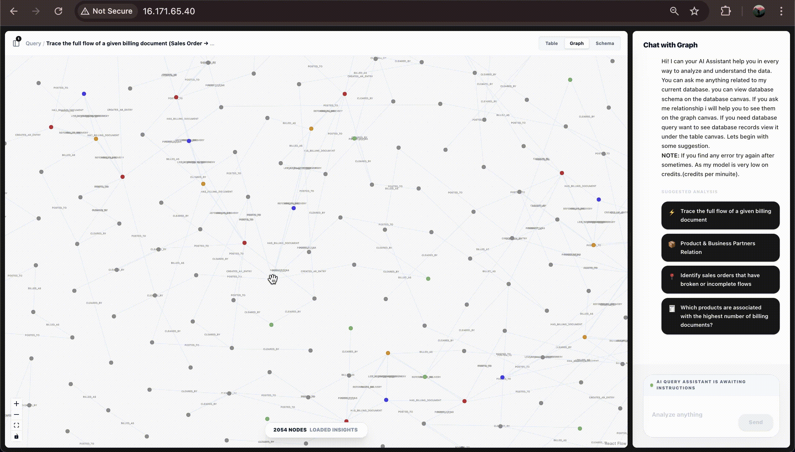
 
---
 
## Exploring Node Relationships
 
There are two ways to explore connections within the graph.
 
### Option 1 — Direct Node Interaction
 
Click on any node to:
 
- Expand its related nodes
- View the direction of relationships
- Access detailed metadata in a dialog panel
 
This is the fastest way to dynamically inspect connections.
 
### Option 2 — Table-Based Exploration
 
1. Navigate to the **Table View**
2. Use the search bar to filter results
   - Example: `delivery document-80738043`
3. Select one or more rows using the checkboxes
4. Switch back to the **Graph View**
5. Selected entries will be **highlighted** in the graph for focused analysis
 
<p align="center">
  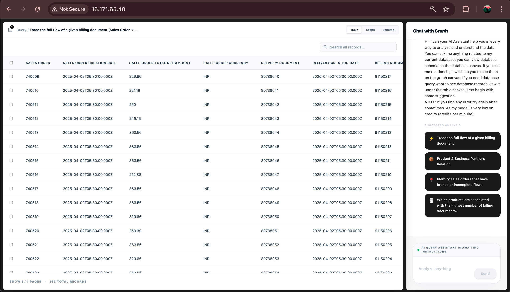
  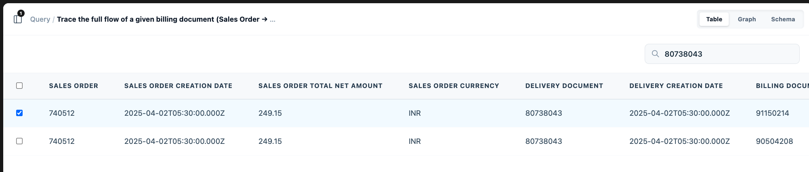
  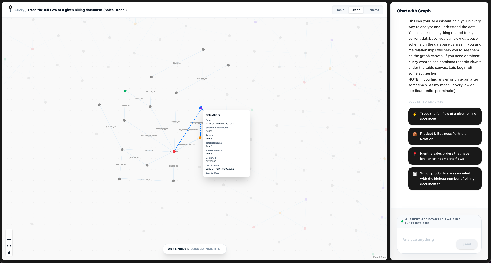
</p>
 
---
 
## Filtering and Data Selection
 
The Table View provides structured control over your data:
 
- **Search and filter** large datasets using the search bar
- **Select multiple entities** using checkboxes
- **Narrow results** before switching to the graph for visualization
 
This is especially useful when working with large or complex query outputs.
 
---
 
## Performance and Rendering
 
To ensure smooth performance:
 
- Graphs are rendered **on demand** — only when required
- Large datasets are handled with **automatic pagination**
 
If the number of nodes exceeds **3,000**:
 
- Pagination is automatically applied
- Rendering is optimized to prevent UI slowdown
 
> Large graphs may take a few seconds to load depending on dataset size.
 
---
 
## Query History
 
- All queries are **stored locally in the browser**
- You can revisit and rerun previous queries at any time
 
<p align="center">
  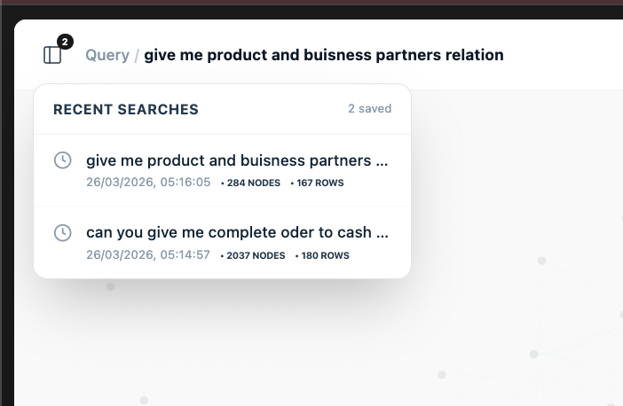
</p>
 
### ⚠️ Known Issue
 
In some cases, **edges may take time to render** after revisiting a previous query.
 
**Temporary workaround:** Refresh the page and reload the query.
 
---
 
## Natural Language Capability
 
The system is designed to understand queries written in plain English. It can:
 
- Interpret intent from natural language
- Identify relevant entities and relationships in the dataset
- Generate structured backend queries automatically
- Return accurate, data-backed responses
 
<p align="center">
  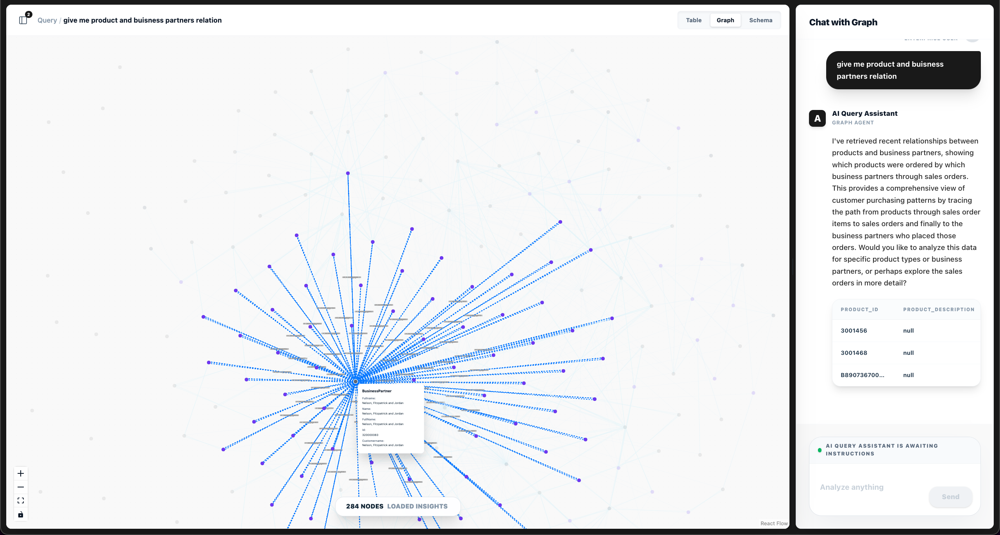
</p>
 
---
 
## Guardrails and Query Scope
 
The AI operates strictly within the bounds of the connected dataset.
 
| Type | Examples |
|---|---|
| ✅ **Supported** | Dataset-specific questions, relationship and flow analysis |
| ❌ **Not Supported** | General knowledge questions, unrelated or out-of-scope prompts |
 
If a query falls outside the dataset scope, the system responds:
 
```
This system is designed to answer questions related to the dataset only.
```
 
<p align="center">
  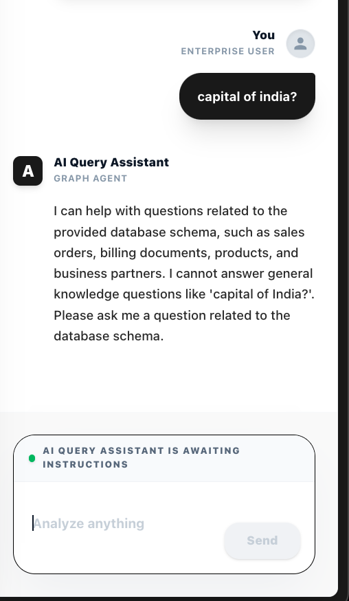
</p>


## How My Query is processed from frontend to backend

```
User types query
      │
      ▼
useChatEngine (Frontend Hook)
      │
      ▼
POST /api/interpret-query
      │
      ▼
multiHopService → promptGenerator (Gemini AI)
      │
      ├──► SQL → PostgreSQL → Table Data
      │
      └──► Cypher → Neo4j → Graph Nodes + Edges
      │
      ▼
Frontend renders Graph Canvas / Table Canvas / Chat
```

---

## Step 1 — User Types a Query

When you send a message like *"Show sales orders with broken delivery flows"*, the `Sidebar.jsx` calls the `useChatEngine` hook.

**File:** `frontend/src/hooks/useChatEngine.js`

- The query + last 6 messages of conversation history are bundled together.
- A `limit` setting controls how many results to fetch: `few` (default), `50%`, or `all`.
- An `AbortController` is attached so a stale request can be instantly cancelled.

---

## Step 2 — Sending to the Backend

**File:** `frontend/src/services/api.js`

The hook calls `interpretQuery()`, which sends:

```json
POST /api/interpret-query
{
  "query": "Show sales orders with broken delivery flows",
  "history": [...last 6 messages],
  "limit": "few"
}
```

The Nginx reverse proxy routes this from the frontend port `5173` → backend port `3000`.

---

## Step 3 — AI Query Planning (Gemini)

**File:** `backend/src/services/promptGenerator.js`

The backend passes the query to **Google Gemini** (via the `@google/generative-ai` SDK).

The system prompt instructs Gemini to act as a *Senior Data Engineer + AI Query Planner*. It is given:

- The **full PostgreSQL database schema** (all tables + columns).
- All **relationship definitions** (JOIN paths between tables).
- **Strict SQL rules**: always `SELECT DISTINCT`, never use `LIMIT 100`, always use PostgreSQL-native functions.
- **Graph generation rules**: only generate Cypher if the query implies tracing a flow or relationship.

Gemini responds with a structured **Execution Plan** in JSON:

```json
{
  "type": "graph",
  "message": "Here is the order-to-cash flow...",
  "queries": [
    { "sql": "SELECT DISTINCT soh.sales_order, ...", "purpose": "Fetch order-delivery chain" }
  ],
  "cypher": "UNWIND $rows AS row\nFOREACH (_ IN CASE WHEN row.sales_order IS NOT NULL THEN [1] ...",
  "options": [{ "label": "Show billing documents", "action": "..." }]
}
```

### 🔄 API Key Rotation & Multi-Model Fallback

If Gemini returns a `429 Rate Limit` error, the system automatically:
1. Rotates to the next API key (`GEMINI_API_KEY1` → `GEMINI_API_KEY2` → ... up to 5 keys).
2. If all keys are exhausted for a model, switches to the next model:
   - `gemini-2.5-flash` → `gemini-2.5-pro` → `gemini-2.0-flash` → etc.

---

## Step 4 — Plan Validation

**File:** `backend/src/utils/validatePlan.js`

Before executing anything, the AI's plan is validated:
- Does it have valid SQL queries?
- Are the node types recognizable?
- Is the Cypher safe to run?

If validation **fails**, the system gracefully returns a `clarification_required` message instead of crashing, and suggests alternative follow-up actions.

---

## Step 5A — SQL Execution (PostgreSQL)

**File:** `backend/src/services/executionQueue.js`

For all plan types (`graph`, `chat`, `interactive`), the SQL queries are executed against **PostgreSQL**.

```sql
SELECT DISTINCT soh.sales_order, soi.sales_order_item, odh.delivery_document, ...
FROM sales_order_headers soh
LEFT JOIN sales_order_items soi ON soh.sales_order = soi.sales_order
LEFT JOIN outbound_delivery_items odi ON soi.sales_order = odi.reference_sd_document
...
LIMIT 5000
```

The results are:
- Stored in `plan.table` (the **Table Canvas**).
- Passed into the next step as `$rows` for graph hydration.

---

## Step 5B — Graph Generation (Neo4j)

**File:** `backend/src/services/neo4jService.js`

If the plan type is `graph`, the Cypher query runs on **Neo4j**. The SQL results from Step 5A are passed as `$rows` parameters so the graph always reflects the real data.

**Example Cypher pattern:**
```cypher
UNWIND $rows AS row

FOREACH (_ IN CASE WHEN row.sales_order IS NOT NULL THEN [1] ELSE [] END |
  MERGE (so:SalesOrder {id: row.sales_order})
)
FOREACH (_ IN CASE WHEN row.delivery_document IS NOT NULL THEN [1] ELSE [] END |
  MERGE (od:OutboundDelivery {id: row.delivery_document})
  MERGE (so:SalesOrder {id: row.sales_order})
  MERGE (so)-[:DELIVERED_AS]->(od)
)

MATCH (n) WHERE n.id IN all_ids
OPTIONAL MATCH (n)-[r]-(m) WHERE m.id IN all_ids
RETURN n, r, m
```

This `FOREACH` + null-safe `MERGE` pattern ensures:
- No rows are silently dropped if a column is `NULL`.
- Isolated nodes are still returned (no `RETURN p` path dropping).

Neo4j returns `nodes[]` and `edges[]`, which the frontend renders with **React Flow + D3 Force** physics.

---

## Step 6 — Silent Retry on Failure

**File:** `frontend/src/hooks/useChatEngine.js`

If the SQL or graph execution fails (e.g. a column name mismatch), the frontend **automatically retries once**:

1. The original error message is packaged into a new "healing" prompt sent back to Gemini.
2. Gemini is told: *"Your previous plan failed with this error: [error]. Fix the query."*
3. The corrected plan is executed.

This happens silently — the user only sees the final result, not the retry attempt.

---

## Step 7 — Frontend Rendering

**Files:** `GraphCanvas.jsx`, `Sidebar.jsx`, `useChatStore.js`

Based on the response type, the UI switches canvas views:

| Response Type | Canvas Shown | What Gets Populated |
|---|---|---|
| `graph` | Graph Canvas | Nodes + Edges via React Flow |
| `chat` / `interactive` | Table Canvas | Tabular SQL rows |
| `clarification_required` | Chat Sidebar | Follow-up suggestion chips |

The query is also saved to the search history cache so it can be quickly toggled via the **Recent Searches** topbar.

---

## 🔑 Key Files Reference

| File | Role |
|---|---|
| `frontend/src/hooks/useChatEngine.js` | Orchestrates the whole query lifecycle |
| `frontend/src/services/api.js` | HTTP calls to the backend |
| `backend/src/services/promptGenerator.js` | Builds the Gemini prompt + executes AI |
| `backend/src/services/multiHopService.js` | Coordinates SQL + Cypher execution |
| `backend/src/services/executionQueue.js` | Runs SQL against PostgreSQL |
| `backend/src/services/neo4jService.js` | Runs Cypher against Neo4j |
| `backend/src/utils/validatePlan.js` | Validates AI plan before execution |
| `backend/src/services/keyManager.js` | Rotates Gemini API keys on rate limits |


## 🏛️ Core Architectural Decisions

### Decision 1: Dual-Database Strategy (PostgreSQL + Neo4j)

**Why not just SQL?**

SQL can answer *"show me all sales orders"* but struggles with *"trace a broken flow across 5 tables"*. Graph databases natively express multi-hop relationships as first-class citizens.

**Why not just Neo4j?**

Neo4j cannot efficiently handle aggregations, filters, and large row scans on 1M+ records. PostgreSQL is optimized for this.

**The solution — hybrid execution:**

```
User Query
   │
   ├── PostgreSQL: "Fetch the actual business records"
   │         → Returns raw rows (e.g. 5,000 Sales Orders + their Delivery + Billing data)
   │
   └── Neo4j: "Build an in-memory relationship graph from those records"
             → Takes the SQL rows as $rows parameters
             → MERGEs nodes + relationships into a live graph
             → Returns visual nodes[] + edges[]
```

This means the graph is **always backed by real data** — not pre-baked static relationships.

---

### Decision 2: AI-First Query Planning (No Hardcoded Logic)

Rather than writing explicit rule-parsers for every possible query, the system offloads all query planning to **Google Gemini**.

Gemini receives:
- The full PostgreSQL schema (tables + columns)
- All relationship definitions (JOIN paths)
- Strict guardrails (no hallucinated columns, no `LIMIT 100`, always `SELECT DISTINCT`)
- Conversation history (last 6 messages) for context-aware follow-ups

Gemini returns a structured JSON execution plan — not free text — which the backend validates and executes deterministically. This means the AI is used as a **planner**, not an executor. Business logic stays in code.

---

### Decision 3: Decoupled Frontend Architecture (React Hooks)

All heavy frontend logic is extracted into dedicated custom hooks and Zustand stores:

| Layer | File | Responsibility |
|---|---|---|
| UI | `Sidebar.jsx`, `GraphCanvas.jsx` | Render only, no business logic |
| Logic | `useChatEngine.js` | Query lifecycle, retries, abort |
| State | `useChatStore.js` | Global messages, history, pagination |
| Graph State | `useGraphStore.js` | Node/edge data for canvas |
| API | `services/api.js` | HTTP calls to backend |

This means `Sidebar.jsx` has zero knowledge of *how* a query is sent. It just calls `handleSend()`. This makes features like query history replay and programmatic re-querying trivial.

---

## 📄 Pagination — Handling Thousands of Graph Nodes

Large datasets cannot be rendered as a graph all at once. Rendering 50,000 React Flow nodes would freeze any browser.

**Two-Tier Pagination Strategy:**

### Tier 1: Adaptive Mode (≤ 3,000 rows)
If the SQL query returns 3,000 or fewer total rows, all rows are used to hydrate the graph simultaneously. This gives the user a complete picture for reasonably sized datasets.

```js
const itemsPerGraphLoad = 3000;
const isAdaptive = totalRowsCount > 0 && totalRowsCount <= itemsPerGraphLoad;
```

### Tier 2: Page-Based Slicing (> 3,000 rows)
For larger datasets, only the **current page's rows** are used to filter which graph nodes to show.

```js
const startIndex = (currentPage - 1) * itemsPerPage; // itemsPerPage = 300
const currentTableData = tableData.slice(startIndex, startIndex + itemsPerPage);
```

The user can browse through pages in the **Table Canvas**, and the **Graph Canvas updates automatically** to show only the nodes related to that page's records. This is fully reactive — no full re-renders because `GraphCanvas` is wrapped in `React.memo`.

**Connector Node Inclusion:**
When a node is shown from the current page, all nodes it has **edges to** are also included — even if those nodes aren't in the current page's data. This prevents orphaned, disconnected graph islands.

---

## 💾 Caching — Avoiding Redundant AI Calls

**File:** `backend/src/services/cacheService.js`

Every successfully generated execution plan can be cached to avoid re-querying Gemini for the same question.

**How it works:**

1. The query is **normalized** (lowercased, whitespace trimmed, collapsed).
2. A **SHA-256 hash** is generated from the normalized query + limit setting + history.
3. The hash is used as the cache key.
4. The full execution plan (SQL + Cypher + message + options) is written to a **persistent JSON file** on disk (`data/plan_cache.json`).

```js
function generateHash(query) {
  const normalized = query.trim().toLowerCase().replace(/\s+/g, ' ');
  return crypto.createHash('sha256').update(normalized).digest('hex');
}
```

**Advantages:**
- Survives server restarts (disk-persisted).
- Semantic deduplication — *"show me sales orders"* and *"Show Me Sales Orders"* map to the same hash.
- Tracks `usage_count` per plan for analytics.

> **Note:** The cache is currently disabled during debugging (`getPlanFromCache` is commented out in `multiHopService.js`). Re-enable it to drastically reduce Gemini API costs in production.

---

## 🔄 Rate Limiting — Multi-Key + Multi-Model Fallback

**File:** `backend/src/services/keyManager.js`

Gemini's free-tier API has tight rate limits (requests per minute per key). To stay within limits across heavy usage:

### Round-Robin Key Rotation

A `KeyManager` class loads all `GEMINI_API_KEY1` → `GEMINI_API_KEY5` from `.env` at startup.

```js
rotate() {
  this.currentIndex = (this.currentIndex + 1) % this.keys.length;
}
```

When a `429 Too Many Requests` error is detected, the system immediately rotates to the next key and retries the same model without throwing an error upward.

### Cascading Model Fallback

If **all keys are exhausted** for a given model, the system tries the next model in priority order:

```
gemini-2.5-flash  (fastest, lowest quota)
       ↓ if 429 on all keys
gemini-2.5-pro    (smarter, different quota bucket)
       ↓ if 429 on all keys
gemini-2.0-flash
       ↓ if 429 on all keys
gemini-3.1-flash-lite-preview
```

This means a single user query can automatically try up to **20 combinations** (5 keys × 4 models) before finally failing — usually successfully resolving without any user-visible error.

---

## 🔁 Silent Retry — Self-Healing on SQL Failures

**File:** `frontend/src/hooks/useChatEngine.js`

Sometimes Gemini hallucinates a column name or generates a slightly wrong JOIN. Instead of showing an error immediately, the frontend **automatically retries once** with a healing prompt:

```js
// On first failure:
await handleSend(queryToUse, {
  error: gErr.message,
  hint: gErr.response?.data?.hint
});
```

The retry prompt tells Gemini exactly what went wrong:

```
"The previous execution for query '...' failed with error:
column 'xyz' does not exist.
Hint: Check table and column names in schema.json.
Please fix the query and provide a valid execution plan."
```

This means transient AI errors are invisible to the user in the majority of cases.

---

## 🧠 Handling More Nodes — Scalability Guide

Currently tested up to ~20,000 SQL rows / ~8,000 graph nodes. Here's how to scale further:

### Short Term (current system)
| Strategy | Implementation |
|---|---|
| Reduce `itemsPerPage` | Lower from 300 → 100 for faster graph updates |
| Disable adaptive mode | Force page-based mode even for < 3,000 rows |
| Increase `alphaDecay` | Faster D3 force simulation for sparse graphs |

### Medium Term (next upgrades)
| Strategy | Effort |
|---|---|
| **WebGL Rendering** | Replace React Flow with `sigma.js` or `pixi.js` — handles 100k+ nodes at 60fps |
| **Clustered Nodes** | Group nodes by type (e.g. all `SalesOrder` nodes collapse into 1 cluster) |
| **Backend Graph Aggregation** | Pre-aggregate the graph in Neo4j before returning to frontend |
| **Streaming Responses** | Stream graph node batches progressively instead of one large JSON payload |

### Long Term (production scale)
| Strategy | Effort |
|---|---|
| **Neo4j Graph Data Science** | Use GDS algorithms (PageRank, Community Detection) to surface meaningful subgraphs |
| **Redis Cache** | Replace the disk-file cache with Redis for shared multi-instance caching |
| **Worker Threads** | Move SQL execution to Node.js worker threads for non-blocking request handling |
| **Read Replicas** | Route heavy SELECT queries to PostgreSQL read replicas |

---

## 🚀 Future Improvements

### AI & Query Intelligence
- [ ] **Intent Classifier** — Pre-classify queries before sending to Gemini (`graph`, `table`, `chat`) to skip expensive AI calls for simple lookups.
- [ ] **Schema-Aware Autocomplete** — Suggest column/table names in the chat input as you type.
- [ ] **Query Explainer** — Show users the exact SQL + Cypher that was generated in a collapsible panel.

### Performance
- [ ] **Virtual Scrolling** — Replace the table pagination with virtualized row rendering (`react-virtual`) to eliminate DOM overhead on large tables.
- [ ] **Graph Layout Caching** — Cache D3 force simulation results per query hash to avoid re-computing physics on revisit.
- [ ] **Re-enable Plan Cache** — Remove the debug comment-out in `multiHopService.js` to restore Gemini call deduplication.

### UX
- [ ] **Graph Minimap** — Add a minimap overlay for navigating large graphs with hundreds of nodes.
- [ ] **Node Drill-Down** — Click a node to load its detailed sub-graph on demand (lazy graph expansion).
- [ ] **Export** — Export graph as PNG/SVG or table as CSV/Excel directly from the UI.

### Infrastructure
- [ ] **Horizontal Scaling** — Move from PM2 single-instance to a PM2 cluster mode (`pm2 start index.js -i max`).
- [ ] **SSL / HTTPS** — Set up Certbot + Let's Encrypt on the Nginx server for production-grade HTTPS.
- [ ] **Health Dashboard** — Surface backend logs, cache hit rate, API key usage, and response time in a real-time admin panel.
- [ ] **CI/CD Pipeline** — GitHub Actions workflow: on push to `main`, `scp` new files to EC2 and trigger `runner.sh` automatically.

---

## 📁 Full Project Structure

```
graph-Explorer/
├── frontend/
│   └── src/
│       ├── components/      # Pure UI (GraphCanvas, Sidebar, Topbar)
│       ├── hooks/           # Business logic (useChatEngine)
│       ├── store/           # Global state (useChatStore, useGraphStore)
│       └── services/        # API calls (api.js)
│
├── backend/
│   ├── index.js             # Express entry point + route registration
│   └── src/
│       ├── config/          # DB connections (db.js, neo4j.js, schema.json)
│       ├── controllers/     # HTTP request handlers (aiController, graphController)
│       ├── routes/          # Route definitions (ai.js, graph.js, schema.js)
│       ├── services/        # Core logic
│       │   ├── promptGenerator.js    # Gemini AI + key rotation
│       │   ├── multiHopService.js    # Orchestrates SQL + Cypher execution
│       │   ├── executionQueue.js     # PostgreSQL query runner
│       │   ├── neo4jService.js       # Cypher executor
│       │   ├── cacheService.js       # SHA-256 disk plan cache
│       │   └── keyManager.js         # Round-robin API key rotation
│       └── utils/           # Helpers (schemaLoader, validatePlan)
│
├── runner.sh                # One-command production restart script
├── README.md                # Project overview
├── QUERY_PIPELINE.md        # End-to-end query flow documentation
└── ARCHITECTURE.md          # This file
```


